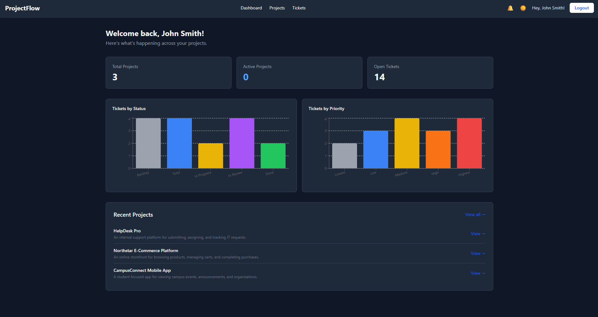
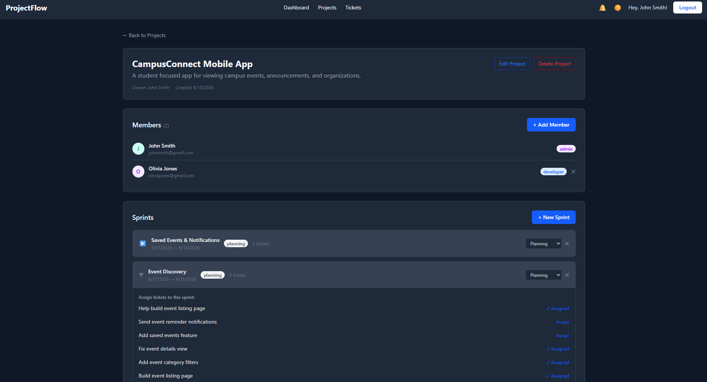
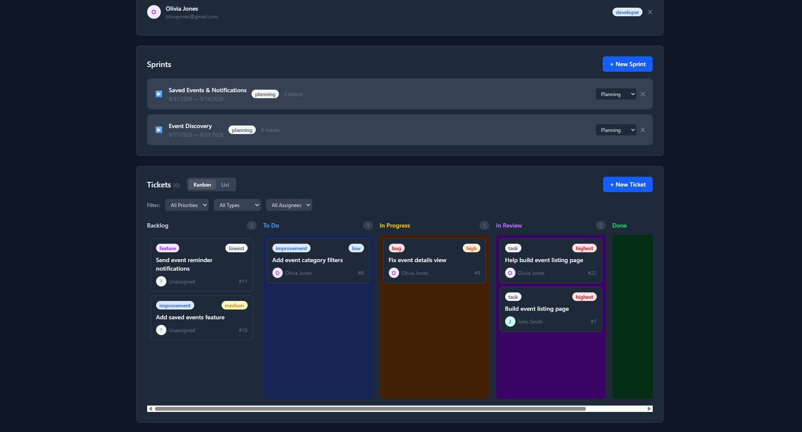
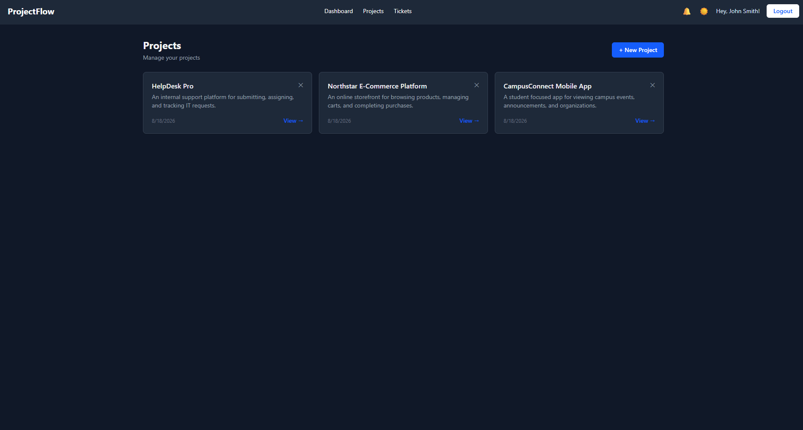
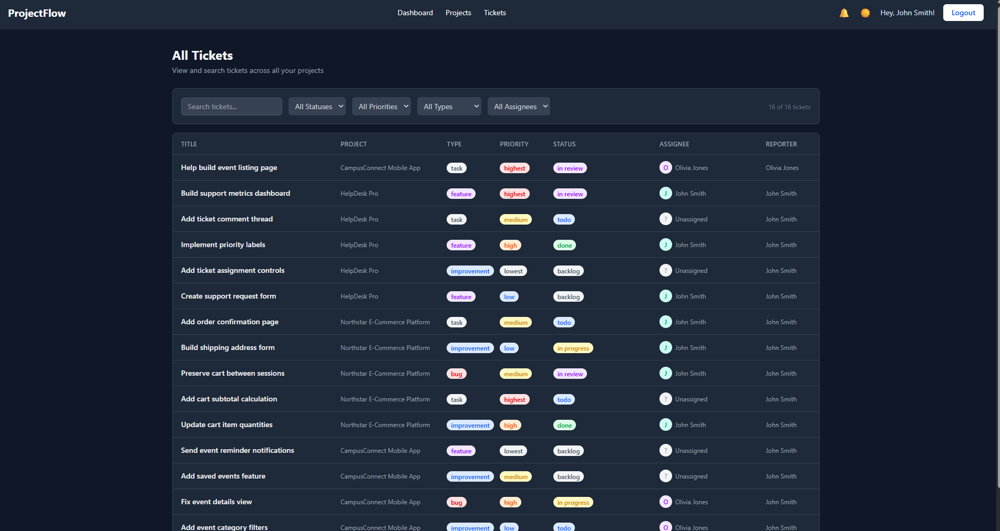
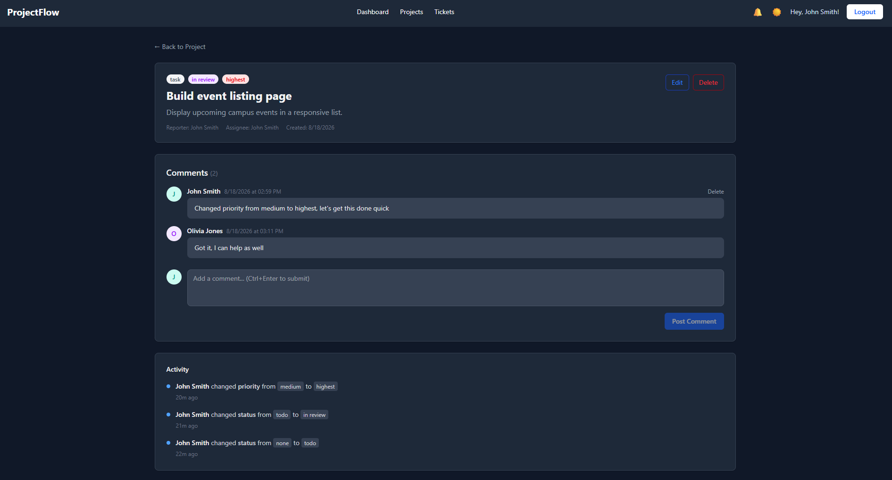
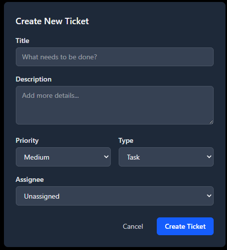
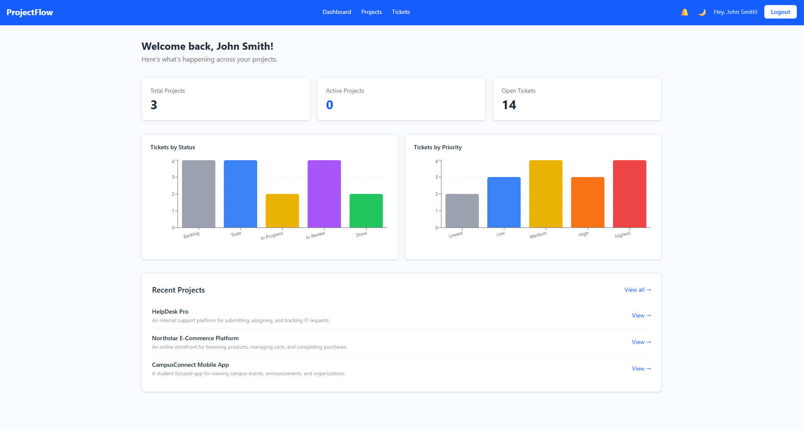
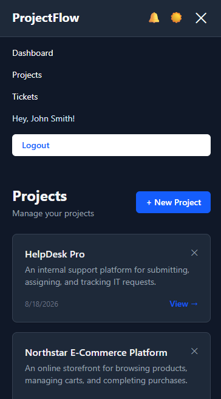

# ProjectFlow

A full stack, Jira inspired project management and ticket tracking application. Built by me with the help of Claude as a passion/learning project to help me get exposure and experience with end-to-end full stack development, from database/backend/frontend design, all the way to a deployed, production level application.

**Live demo:** [jira-clone-rho-inky.vercel.app](https://jira-clone-rho-inky.vercel.app)

> **Important Note:** this project is hosted on free tier website infrastructure. The backend (Render) spins down after 15 minutes of inactivity and may take 30–60 seconds to "wake up". The production database (hosted through Aiven) may also go down after extended inactivity, and may cause the site to not function if I haven't manually restarted the service recently. If the live demo seems unresponsive on first visit, please wait a minute and try again, or refer to the screenshots/video of site demo.

**Dashboard:**



---

## Demo

[](https://youtu.be/NwF-piiDFmU)

A ~5 minute walkthrough of ProjectFlow (no audio/commentary).

---

## Features

**Authentication & Users**
- JWT (JSON Web Token) based registration and login, with persistent sessions across page refreshes
- Editable user profiles (name, email)
- Color coded avatars generated automatically based on usernames 

**Projects**
- Full CRUD (Create, Read, Update, Delete) for projects
- Role based project membership (Admin / Developer / Viewer), enforced on both frontend and backend
- Ability to invite members by email

**Tickets**
- Full CRUD for tickets - title, description, status, priority, type, and assignee
- Drag and drop Kanban board (with touch support for mobile) with five workflow columns
- List view as an alternative to Kanban
- Filtering by priority, type, and assignee - both within a project and across all projects
- Global search across every ticket the user has access to
- Full activity/history log per ticket (status, priority, type, and assignee changes)
- Threaded comments on tickets with keyboard shortcut for sending (Ctrl + Enter)

**Sprints**
- Create and manage sprints with start/end dates and status (planning / active / completed)
- Assign tickets to sprints

**Dashboard & Analytics**
- At a glance stats: total projects, active projects, open tickets
- Ticket breakdowns by status and priority, visualized with interactive charts

**Notifications**
- In app notifications when a user is assigned to a ticket 
- Polling based live updates without requiring a page refresh

**Platform**
- Full responsive design, tested on mobile as well
- Dark mode with persistent user preference
- Deployed with a real production database (again, unfortunately it is the free tier so it may stop running after a period of inactivity, requiring a manaual restart from me)

---

## Screenshots

### Project View
View project details, members, sprints, tickets, etc:



### Kanban Board
Keeps track of a projects' tickets in an organized kanban arrangement:



### Projects Overview
View and access all projects the user is a member of:



### Ticket List
Browse, search, and filter tickets across projects in a structured list view:



### Ticket Details
View ticket information, update fields, assign users, and leave comments:



### Create a New Ticket
Create a ticket with its project, title, description, type, priority, status, and assignee:



### Light Mode Dashboard
The dashboard displayed using the light mode theme (instead of dark view shown in other screenshots):



### Responsive Mobile View
ProjectFlow's navigation and interface adapted for smaller mobile screens:



---

## Tech Stack

| Layer | Technology |
|---|---|
| Frontend | React (Vite) |
| Styling | Tailwind CSS |
| Charts | Recharts |
| Drag & Drop | dnd-kit |
| Backend | Node.js, Express |
| Database | MySQL |
| Auth | JWT, bcryptjs |
| HTTP Client | Axios |

**Deployment**
| Service | Hosts |
|---|---|
| [Vercel](https://vercel.com) | Frontend |
| [Render](https://render.com) | Backend API |
| [Aiven](https://aiven.io) | Production MySQL database |

---

## Architecture

```
┌───────────────┐        HTTPS        ┌─────────────────┐        SSL/TLS       ┌─────────────┐
│    Vercel     │  ────────────────>  │     Render      │  ─────────────────>  │    Aiven    │
│  (React app)  │                     │  (Express API)  │                      │   (MySQL)   │
└───────────────┘                     └─────────────────┘                      └─────────────┘
```

The frontend and backend are deployed independently, communicating entirely over HTTPS. The backend connects to a fully managed, SSL required MySQL instance that is completely separate from my local development database I used for dev/testing.

---

## Local Development

### Prerequisites
- Node.js and npm
- [XAMPP](https://www.apachefriends.org/) (for local MySQL)

### Setup

1. Clone the repo
   ```bash
   git clone https://github.com/spencerbetchey/jira-clone.git
   cd jira-clone
   ```

2. Start XAMPP's **Apache** and **MySQL** modules

3. Set up the database
   - Open phpMyAdmin at `http://localhost/phpmyadmin`
   - Import `schema.sql` (skip the first 4 lines if running manually)

4. Set up the backend
   ```bash
   cd server
   npm install
   ```
   Create a `.env` file in `server/`:
   ```
   PORT=5000
   DB_HOST=localhost
   DB_USER=root
   DB_PASSWORD=
   DB_NAME=projectflow
   JWT_SECRET=your_secret_here
   ```
   ```bash
   npm run dev
   ```

5. Set up the frontend (in a new terminal)
   ```bash
   cd client
   npm install
   ```
   Create a `.env` file in `client/`:
   ```
   VITE_API_URL=http://localhost:5000/api
   ```
   ```bash
   npm run dev
   ```

6. Visit `http://localhost:5173`

---

## Project Structure

```
jira-clone/
├── client/                # React frontend (Vite)
│   └── src/
│       ├── api/           # Axios API layer
│       ├── components/    # Shared, layout, and ticket components
│       ├── context/       # Auth and theme context providers
│       ├── pages/         # Route level pages
│       └── utils/
├── server/                # Node.js + Express backend
│   ├── config/            # Database connection
│   ├── controllers/       # Route logic
│   ├── middleware/        # Auth and role enforcement
│   ├── routes/
│   └── scripts/           # One off setup scripts
└── schema.sql             # Database schema
```

---

## Known Limitations

- **Cold starts:** the backend and database are hosted on free tiers and will spin down after periods of inactivity. This affects response time, not functionality.
- **No real time updates:** notifications and live board changes use polling rather than WebSockets.

---

## About This Project

This was built by me (https://github.com/spencerbetchey) with help from Claude AI, over my summer break between Junior and Senior year of college, mostly as a way to actually learn full stack development by building something professional and functional. React, Node/Express, MySQL, and deployment were all pretty new to me going in, and I wanted a larger scale project that I could take day by day and use as a chance to learn some new technologies that I was interested in. One of my goals for this project was to push myself far out of my comfort zone and build something bigger than I ever had by myself, so even though using Claude as a learning, planning, and debugging tool was very useful, making the product decisions, writing/testing everything, and understanding how all the pieces come together was more important and valuable than anything. I'm not going to pretend I could've done the whole thing solo from day 1, but this was a genuine learning project first, and I grew as a developer so much because of it.